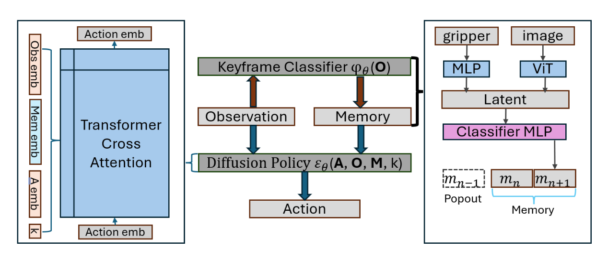
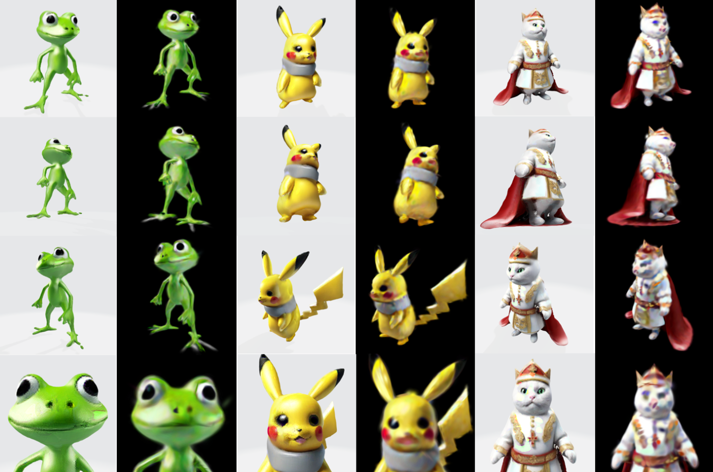

___
## **1，Memory Guided Diffusion Policy for Robot Learning（CoRL2025二作在投）**
针对机器人模仿学习中重复任务与长序列任务，提出了一种通过一个预训练的ViT进行关键帧判断，融合记忆关键帧来增强Diffusion Policy的方法。

**我的贡献：**
- 帮助设计整体pipeline
- 完善真机数据采集流程
- 进行模型训练与实机实验

**成果：**
- 使用特定夹爪完成了类UMI数据采集与真机模型部署
- 提高Diffusion Policy 面对重复奇异性任务与长序列任务的成功率
  
**项目链接**：[MGDP](https://memoryguideddp.github.io/)

  <video width="400" height="500" controls autoplay muted>
    <source src="../assets/video/umi2.webm" type="video/webm">
    您的浏览器不支持 HTML5 视频标签。
  </video>

  

    <video width="400" height="250" controls autoplay muted>
      <source src="../assets/video/manipulation1.webm" type="video/webm">
      您的浏览器不支持 HTML5 视频标签。
    </video>
    <video width="400" height="250" controls autoplay muted>
      <source src="../assets/video/manipulation2.webm" type="video/webm">
      您的浏览器不支持 HTML5 视频标签。
    </video>
  

___
## **2，人形/双轮足机器人强化学习控制与部署**
针对人形/双轮足机器人在高纬的运动控制问题，搭建isaacgym仿真器环境，使用强化学习PPO算法在仿真器中进行运动policy训练，提升其稳定性和适应性。

**我的贡献**：
- 负责算法调优与仿真实验。基于Isaacgym仿真环境，使用PPO算法进行训练。
- 根据实机硬件情况，添加域随机化。
- 参与硬件部署与调试。
- 添加了速度预测网络Estimator，DreamWaQ（基于VAE的地形隐Encoder），RMA（基于Teacher-Student的特权观测Encoder）的实现与测试。
- 添加web-visualizer，在没有gui的server上提供可视化训练。

**成果：**：
- 成功完成人形机器人sim2real，在直线电机（isaacgym只支持旋转电机）机器人平台上实现了强化学习原地踏步。
- 成功完成双轮足机器人sim2real，在大质量双轮足机器人平台上部署了强化学习运动控制，实现坑洼路面稳定通过。
  
**项目链接**：[humanoid-RL](https://github.com/Urutoramarin2000/humanoid-rl) ； [Wheeled-RL](https://github.com/Urutoramarin2000/wheeled_rl)

  <video width="400" height="500" controls autoplay muted>
    <source src="../assets/video/humanoid2.webm" type="video/webm">
    您的浏览器不支持 HTML5 视频标签。
  </video>

  

    <video width="400" height="250" controls autoplay muted>
      <source src="../assets/video/wheeled_bipedal_3.webm" type="video/webm">
      您的浏览器不支持 HTML5 视频标签。
    </video>
    <video width="400" height="250" controls autoplay muted>
      <source src="../assets/video/wheeled_bipedal_4.webm" type="video/webm">
      您的浏览器不支持 HTML5 视频标签。
    </video>
  

___

## **3，基于Quest3的机械臂VR无线遥操作**
基于Vuer，使用Quest3，实现机械臂的VR远程Teleop。

**我的贡献：**：
- 基于vuer搭建vr环境
- 在环境中接入realsense相机画面
- 在环境中添加机器人模型，对齐遥操空间与真实空间
- 接入机械臂底层，设计遥操作控制逻辑，防止机械臂危险行为
  
**成果：**
- 实时视频流集成。将 RealSense 相机的实时画面无缝集成到 VR 环境中，为操作者提供直观的视觉反馈。
- 真实空间与虚拟空间对齐，在 VR 环境中复现了机械臂和机器人的模型，并实现了遥操作空间与真实物理空间的 1:1 映射，让机械臂ee跟随controller位置，提供直观精确的控制。
  
**项目链接**：[Quest3_teleop_record](https://github.com/Urutoramarin2000/quest3_teleop_record)

  <video width="400" height="360" controls autoplay muted>
    <source src="../assets/video/teleop3.webm" type="video/webm">
    您的浏览器不支持 HTML5 视频标签。
  </video>
  <video width="400" height="360" controls autoplay muted>
    <source src="../assets/video/teleop4.webm" type="video/webm">
    您的浏览器不支持 HTML5 视频标签。
  </video>

___
## **4，基于扩散模型与 3D 高斯的文本-3D 模型生成（毕业设计）**
基于 transformer 的 3d 高斯生成模型，结合 SDS 的形状优化与扩散模型的texture 优化来完成基于文本 - 高质量3D模型的生成。

**成果**：
- 结合基于tranfromer的快速3D模型生成与基于SDS的模型精细优化，完成告快速高质量3D模型生成。

